# GatherSpace

A simple messaging application developed using Kotlin Multiplatform with Desktop, Android and Web clients.

## Project Structure

The project contains four main modules:

#### [composeApp](composeApp): [Compose multiplatform](https://www.jetbrains.com/compose-multiplatform/) app module used for the Android and Desktop applications

#### [server](server): Backend server module developed using [Ktor](https://ktor.io/)

#### [web](web): [Kobweb](https://github.com/varabyte/kobweb) app module used to develop the web application

#### [shared](shared):

- [common](shared/common) - Common code used across all platforms
- [domain](shared/domain) - Domain layer for shared code used across the target client applications
- [network](shared/network) - Network layer for the shared code used across the target client applications
- [presentation](shared/presentation) - Presentation layer for the shared code used across the target client
  applications

## Screenshots

### Desktop

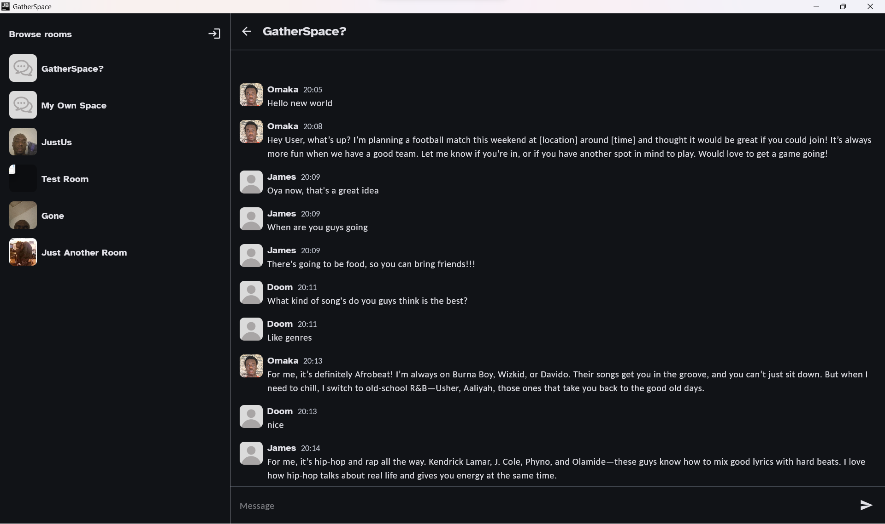

### Android

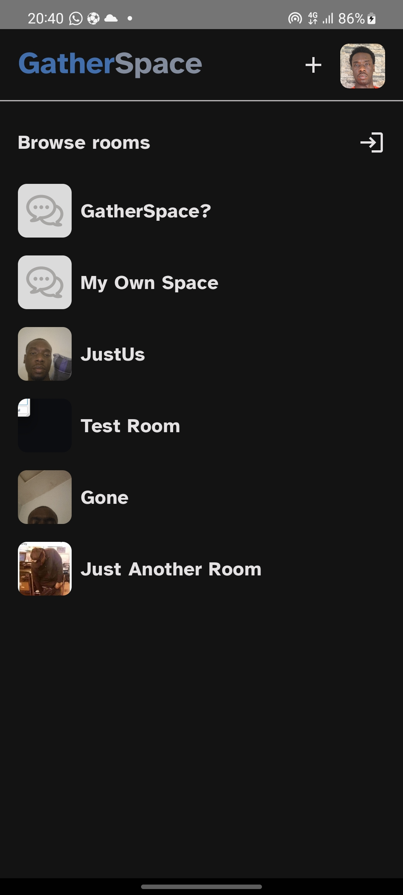
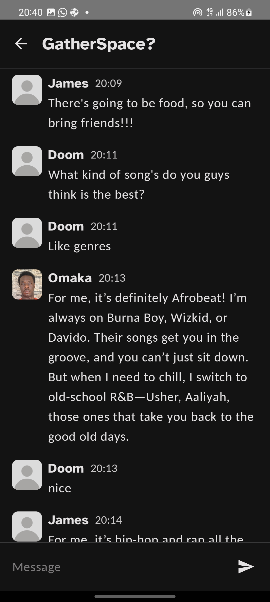
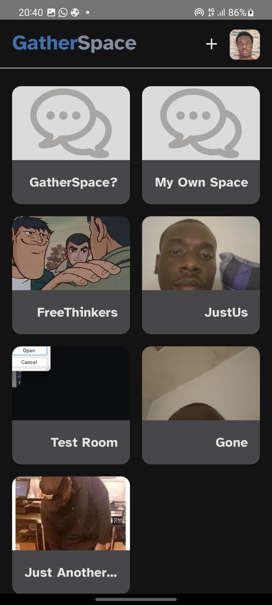

### Web

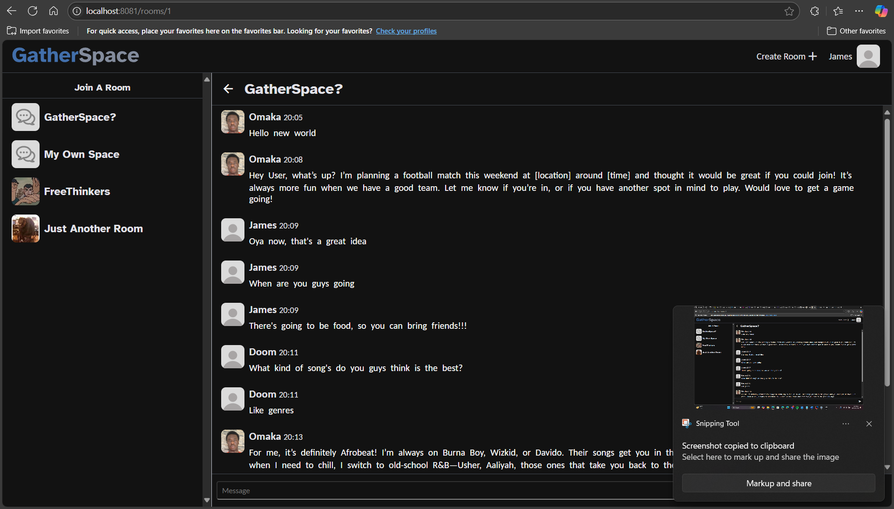
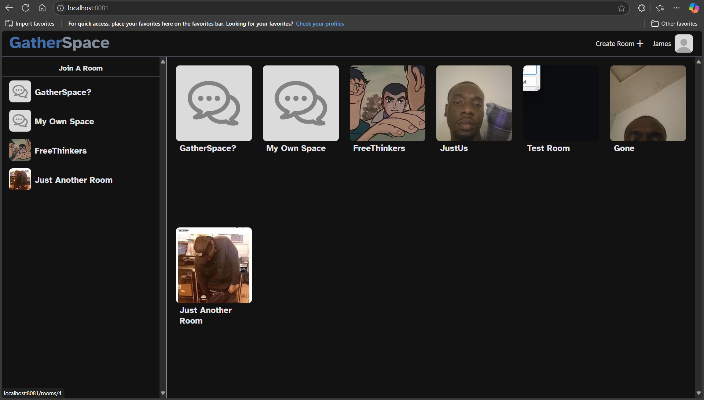
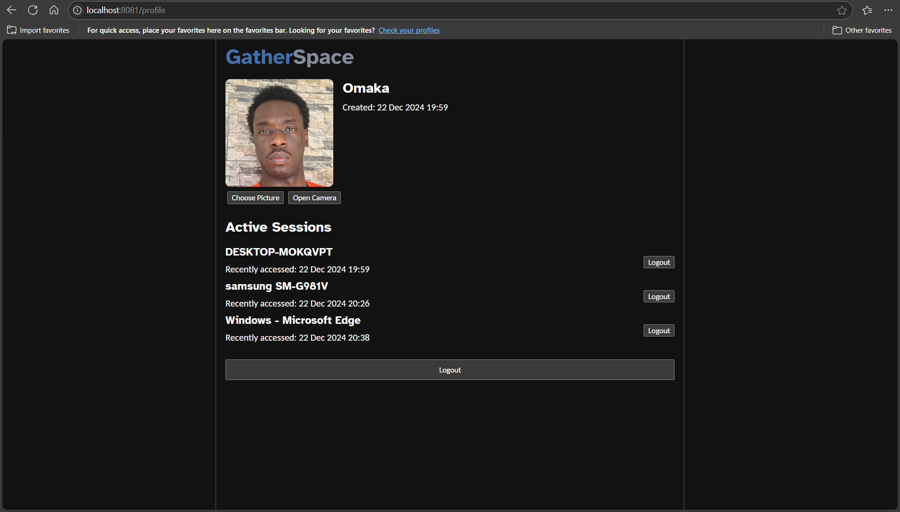

##### Mobile

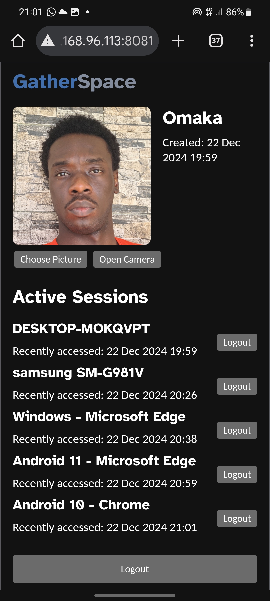
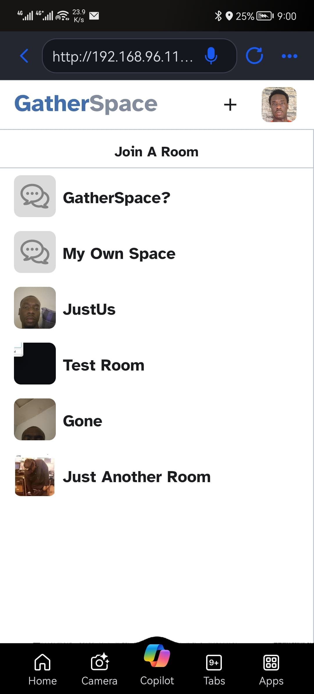
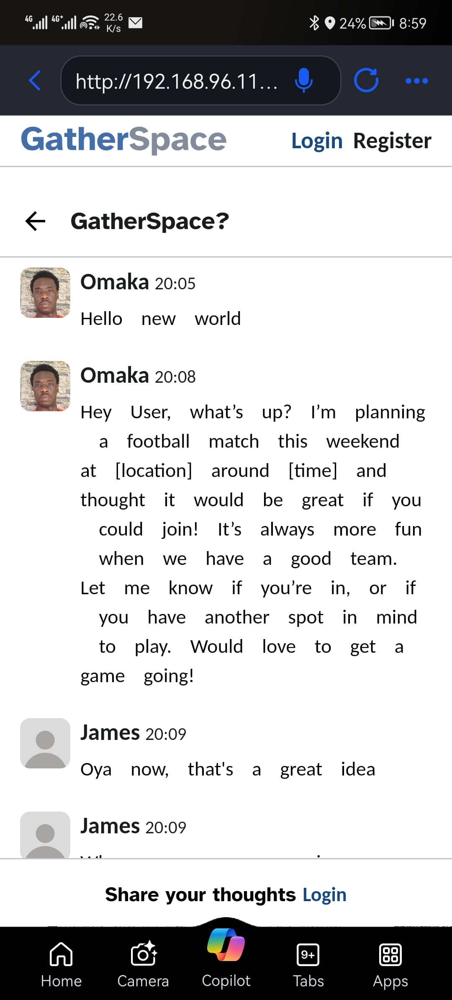
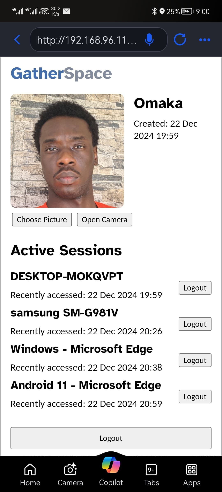

## Running the application

### Requirements

- [Android SDK and related tools](https://developer.android.com/studio)
- [IntelliJ Idea](https://www.jetbrains.com/idea/)
  with [Android Plugin](https://plugins.jetbrains.com/plugin/22989-android)
  or [Android Studio](https://developer.android.com/studio) or any suitable IDE
- Android Emulator and a virtual device or a physical android device
- [PostgreSQL](https://www.postgresql.org/download/)
- [Kobweb](https://github.com/varabyte/kobweb#install-the-kobweb-binary)

### Server

> **Note:**
> PostgreSQL must have been set up/installed to run the server

To run the Server:

- Set the database username and password
  at [Application.kt](server/src/main/kotlin/com/omasyo/gatherspace/Application.kt)
- Set the IP Address of the server
  at [Api.kt](shared/common/src/commonMain/kotlin/com/omasyo/gatherspace/network/Api.kt)
- You can modify the path to store image files [here](server/src/main/kotlin/com/omasyo/gatherspace/utils/Utils.kt)
- In the list of configurations run `Application.kt` to start the server
- Alternatively you can run with gradle using `./gradlew server:run`

### On Desktop

- Ensure the server is running
- Run with application using `./gradlew composeApp:run`

### On Android

- Ensure the server is running
- Connect to your Android device or virtual device using [adb](https://developer.android.com/tools/adb).
- Using Android Studio/IDEA you can sync the gradle project and run the application using the default configurations.
- Alternatively you can install the app directly on the device using gradle by running `./gradlew installDebug` from
  the project directory.

### On Web

- Ensure the server is running
- Start the webserver by running `kobweb run -p web` from the project directory.
- Alternatively you can start the server with gradle using `./gradlew web:kobwebStart` and stop it using
  `./gradlew web:kobwebStop`
- You can access the server using [http://localhost:8081/](http://localhost:8081/)
- The port used for the frontend server can be modified at [conf.yaml](web/.kobweb/conf.yaml)

> **Note**: Capturing image directly from the camera on web only works on the host machine(using *localhost*) because
`getUserMedia()` cannot be accessed over unencrypted HTTP.
>
> From [MDN documentation for
`MediaDevices.getUserMedia():`](https://developer.mozilla.org/en-US/docs/Web/API/MediaDevices/getUserMedia#using_getusermedia)
>  > Note: If the current document isn't loaded securely, navigator.mediaDevices will be undefined, and you cannot use
> > getUserMedia(). See Security for more information on this and other security issues related to using getUserMedia().